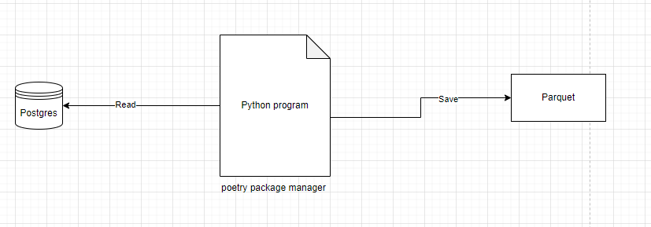

Part 1

Create a new github project (give me and gavin access)
Create a new spark project using poetry as you buid tool and package manage (https://python-poetry.org/)
start a postgres database in docker (populate a table with some data)
create a spark program that reads from this database and saves the ouput as parquet

Part 2

write a unit test for this program

Part 3

Make the spark program configurable so that i can parametrize
the database and table name
the writing format (csv or parquet)
The target location to write to

Part 4

Make a new python library that does the writing call it spark-common
Tear out the reading functionality and add it to this new project and build this project
include this new project as a pip dependencies in your new program
Call this library from the original program

Part 5

Use Delta lake (https://delta.io/) as the output format
add functionality to update an existing table with new records using the merge statement
